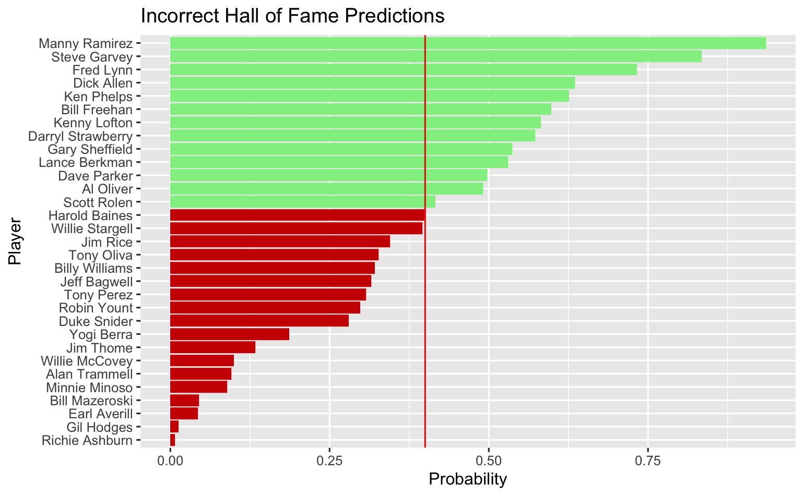
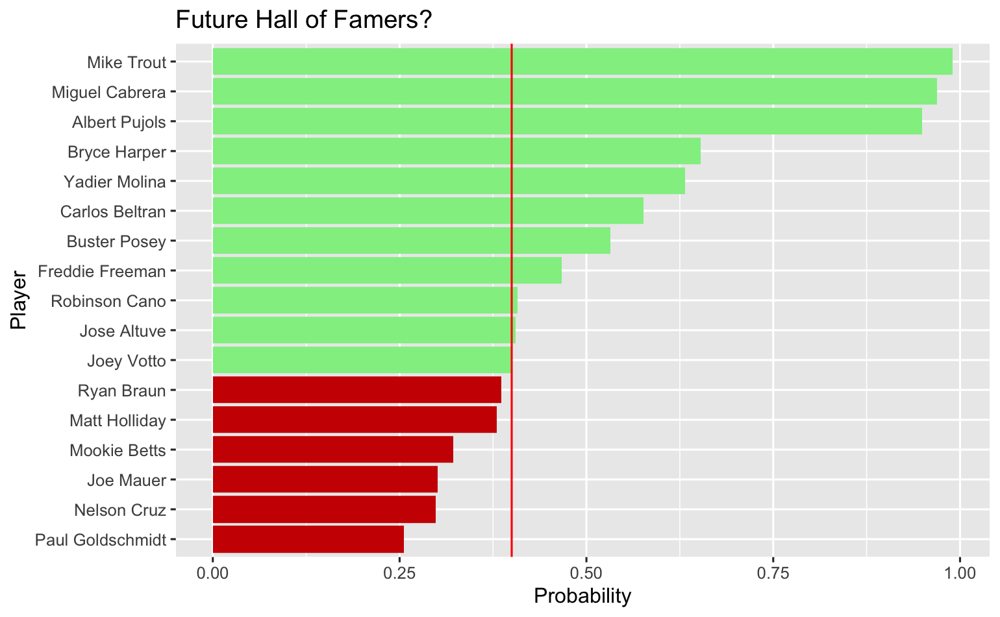

# Hall-of-Fame

My goal for this project was to try and understand how the MLB decides whether or not to select a player for the Hall of Fame and if I could replicate their selection strategy by building models using statistics. All of the data being used has been pulled from Baseball Reference which includes a list of hall of fame players and a list of players individual season statistics. 
## Data Wrangling

I began with every player's season statistics and since I did not care about how well a player performed over any given season I aggregated the seasons together in order to obtain a career statistical overview. Next was to filter the resulting dataframe so that only players eligible for the hall of fame would be included in the model, meaning they are not currently playing and they retired before 2016. This project is only considering hitters, therefore another filter was applied to both the player list and hall of fame player list so that players with more than 3000 at-bats were considered. Another factor that had to be considered was how I was going to represent awards for each player, so I had to search for the substrings within the awards column to obtain the number of awards each player recieved throughout their career. Certain players have been banned from the hall of fame due to illegal behaviors so they were removed in order to improve model accuracy. I also chose to include a newer statsitic in the game of baseball that can better describe the skill of a player and that is isolated power or ISO which is just slugging percentage subtracted by batting average, so essentially measuring the amount of extra-base hits.

## Testing Models

This is a classifcation problem so a couple models stood out for me to immediately try to explor which include LDA, GLM, and Ridge. After conducting multiple tests and visualizing how exactly models such as GLM and Ridge are weighing the coefficients of certain predictors, it guided me to the model used in my code which included some very common baseball statistics and also all of the award categories (MVP, All-Star, Golden Gloves, and Silver Sluggers). My initial models resulted in correctly predicting 44 out of the 80 hall of famers being considered and incorrectly predicting 44 players (13 were false positives and 31 were false negatives).

## Model Analysis

My main focus was determining which players were being incorrectly classified and investigate similarities between the players. Players who accrewed a large number of awards such as All-Star game selections and MVP's were often incorrectly classified as Hall of Famers due to the high number of players in the Hall of Fame with those same awards. Players who are in the Hall of Fame who were classified as not in the Hall of Fame often lacked very high on-base plus slugging (OPS) which was the most heavily weighted coefficient in the GLM model. I also was interested in if perhaps lowering the default threshold of the probability a player is predicted to be in the Hall of Fame from 0.5 to 0.4 and what I discovered was that the model became more accurate in its predictions. The outcome of changing the threshold was 49 out of 80 hall of fame players being correctly predicted and only 41 players being incorrectly predicted. This result seems intuitive since the vast majority of baseball connoisseurs can very rarily agree on if a player is "Hall of Fame worthy." My next step was to eliminate players who retired before the year 1960 since prior to this time the MLB was still segregated and many players lacked the offensive stats that modern players today have. This adjustment resulted an increase in players correctly predicted to be Hall of Famers from 49 to 51 and the number of incorrect predictions dropping from 41 to 31. The GLM model's coefficient estimates changed drastically, this time placing lots of weight on the at-bats predictor, but remained the same by still placing weight on the All-Star selections predictor. 

The green bars in the graph represent players who were classified as Hall of Famers but are not in the Hall of Fame, adn the red bars conversely represent players who are in the Hall of Fame but were classified incorrectly.

## Future Hall of Famers

Final step and main goal of this project was to try to predict current players who will be elected into the Hall of Fame. After filtering for players who are currently ineligible for the Hall of Fame the model selected only 11 players with a probability of being selected higher than 40%. These players were of no surprise and most baseball fans consider these players "locks" to get in. Albert Pujols, Bryce Harper, Buster Posey, Carlos Beltran, Freddie Freeeman, Joey Votto, Jose Altuve, Miguel Cabrera, Mike Trout, Robinson Cano, and Yadier Molina. Noteably, Mike Trout, Miguel Cabrera, and Albert Pujols had a probability of being selected higher than 90% and most would probably say even that's too low as there is almost no chance these players aren't selected. There are a few players that some may considered to be "on the edge" and within my analysis I considered players that the model assigned a probablity of 0.25 or higher and six players were returned: Joe Mauer, Matt Holliday, Mookie Betts, Nelson Cruz, Paul Goldschmidt, and Ryan Bruan.

## Conclusion

Although the model I constructed is good at predicting MLB Hall of Famers it is not perfect and I would say that the model is just about as good at predicting players as any baseball stat enthusiast. A very interesting statistics I would like to include in this model is Wins Above Replacement (WAR) and this stat is all-encompassing including hitting, fielding, and baserunning. It is a great statistic to measure a player's added wins to a team in comparison to the average league replacement players and recently has been used to measure the overall ability of a players which I assume is now being used when considering votes on the Hall of Fame ballot. Despite the lack of WAR in the model, I believe in the accuracy of this model and I am looking forward to see if these predictions come to fruition when the players become eligible.
Final step and main goal of this project was to try to predict current players who will be elected into the Hall of Fame. After filtering for players who are currently ineligible for the Hall of Fame the model selected only 10 players with a probability of being selected higher than 40%. These players were of no surprise and most baseball fans consider these players "locks" to get in. Albert Pujols, Ichiro Suzuki, David Wright, Bryce Harper, Carlos Beltran, Robinson Cano, Miguel Cabrera, Mike Trout, Matt Holliday, and Yadier Molina. Noteably, Mike Trout, Miguel Cabrera, and Albert Pujols had a probability of being selected higher than 90% and most would probably say even that's too low as there is almost no chance these players aren't selected. There are a few players that some may considered to be "on the edge" and within my analysis I considered players that the model assigned a probablity of 0.25 or higher and ten players were returned: Jose Altuve, Nelson Cruz, Buster Posey, Joey Votto, Joe Mauer, Freddie Freeman, Mookie Betts, Nelson Cruz, Giancarlo Stanton, Ryan Bruan, and Andrew McCutchen.
